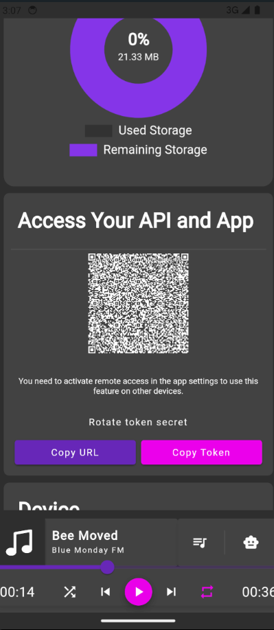

<p align="center">
  
</p>

# MyMusik API Showcase

**Your music. Your library. Everywhere.**

MyMusik is a modern music player for owned music libraries. It brings streaming-level convenience to personal MP3, WAV, FLAC, and local audio collections while keeping users in control of their files, metadata, tags, playlists, sync, backup, and privacy.

This repository is the public developer and marketing showcase for the MyMusik music-player API. It is not the full MyMusik app source code.

- Website: [mymusik.app](https://mymusik.app/)
- Hosted Swagger/API reference: [mymusik.app/swagger](https://mymusik.app/swagger/)
- Local Swagger after downloading and starting MyMusik: `http://localhost:7790/ui/swagger`
- Local API default: `http://localhost:7790/api`
- OpenAPI spec: [`openapi/doc.json`](openapi/doc.json)
- Hosted Angular client ZIP: [mymusik_angular_client.zip](https://shaggai.net/angular_client/client/mymusik_angular_client.zip)
- Generated Python client: [`clients/python`](clients/python)

## What You Can Build

MyMusik turns a device into local music infrastructure for playback, sync, and automation. The HTTP API can be used to:

- Control playback, queue state, playlists, albums, songs, ratings, tags, lyrics, and metadata.
- Trigger imports, cover art updates, selective sync, encrypted backup flows, and device jobs.
- Connect AI command flows to deterministic local music actions.
- Build dashboards, custom player UIs, network controllers, library tools, and automation scripts.

## AI Voice Command System

MyMusik includes an AI voice-command flow for controlling the music player through deterministic app actions. The app records a voice command, transcribes it, builds a prompt with current library and player context, asks the selected AI model to generate JavaScript, and stores the result until the frontend executes it through the initialized `aiMusicController`.

The generated script is constrained to a single runnable `run(aiMusicController)` function. The AI is instructed to use only the functions listed in the API description JSON that the frontend provides for the current command, so voice commands can be connected to real player, queue, playlist, search, sync, and library operations instead of free-form text output.

Voice-command lifecycle endpoints include:

- `POST /aimusicvoicecommand/startvoicerecording`
- `POST /aimusicvoicecommand/stopvoicerecording`
- `POST /aimusicvoicecommand/stopanddeletevoicerecording`
- `POST /aimusicvoicecommand/{id}/retryscriptgeneration`
- `POST /aimusicvoicecommand/report`

## Custom Prompt

The AI script system prompt is customizable in MyMusik settings through `scriptSystemPrompt`. If no custom value is configured, MyMusik uses this default prompt:

```text
You write JavaScript code for a music app.
A variable named aiMusicController is provided and already initialized.
Output only raw JavaScript code.
Do not output markdown or explanations.
You must define exactly one function with this first line:
async function run(aiMusicController) {

Rules:
1. Use only methods listed in API description json.
2. Call methods with the exact parameter style from API description.
3. Do not pass object literals to positional methods.
4. Guard every result before reading result.data.
5. Result data can be arrays or nested objects.
6. Do not import modules and do not use browser globals.
7. Do not construct fake Song, Album, Playlist, QueueItem, or Tag objects.
8. If recent play log contains song identifiers and the user refers to a recent song, prefer identifier based methods.
9. For generic play requests, search from transcript text and try multiple query variants.
10. Return nothing from run.
```

For each command, MyMusik also wraps the transcript with per-request instructions:

- Generate raw JavaScript only.
- Return exactly one runnable function named `run`.
- If the request is unclear, return runnable code and throw `Error` inside `run`.
- If `run` throws `Error`, the message should use the system language.
- Treat the transcript as the primary source.
- Use recent play log and history when the user says things like "previous", "last", or "that song".
- Prefer direct identifier-based methods when the API provides them.

## AI-Available Context

The system prompt can include JSON context that helps the AI resolve natural-language requests into exact API actions:

- Current player state, including current song, playback state, position, duration, volume, mute state, random mode, playback mode, playback rate, and container id.
- Recent play history for resolving references to earlier tracks.
- Most played songs and recently added songs.
- Important playlists and recently added playlists.
- Frontend information for the current screen, selected item, or active workflow.
- API description JSON that lists the functions and parameter styles available to `aiMusicController`.

## AI And Player Capabilities

The same API surface used by scripts and generated clients can also be exposed to AI command flows:

- Playback: `POST /player/play`, `POST /player/playsongs`, `POST /player/startplaying`, `POST /player/stopplaying`, `POST /player/startstoptoggleplaying`, `POST /player/nexttrack`, `POST /player/prevtrack`, `POST /player/seek`, `POST /player/setplaybackrate`.
- Queue: `POST /queueitem/addsongs`, `POST /queueitem/addalbum`, `POST /queueitem/addcontainer`, `POST /queueitem/playsongsnext`, `POST /queueitem/playsongsafternext`, `POST /queueitem/setqueuewithsongs`, `POST /queueitem/setqueuewithalbums`, `POST /queueitem/shuffle`, `POST /queueitem/clear`, `POST /queueitem/removemultiple`, `POST /queueitem/skipitemsupto`.
- Library workflows: songs, albums, playlists, music search, tags, lyrics, metadata editing, audio import, synchronization, cloud backup, storage status, and listening metrics.

## API QR Code And Device Control

A device running MyMusik can host the local API and show an API QR code. Another phone, tablet, or browser on the allowed network can scan that QR code to open the hosted device's MyMusik controller UI/API connection, making it possible to browse or control the music player from a second device.

API QR access still depends on the same security model as the HTTP API: the server is local by default, bearer tokens protect access, and remote/network exposure should only be enabled deliberately in settings.

## Screenshots

| Album view | Song details | AI controls |
| --- | --- | --- |
|  |  |  |

| Search | Insights | Synchronization | API QR device connection |
| --- | --- | --- | --- |
|  |  |  |  |

## Quick Start

Open the hosted Swagger reference for the easiest API tour:

```text
https://mymusik.app/swagger/
```

After downloading and starting MyMusik, open the local in-app Swagger reference here:

```text
http://localhost:7790/ui/swagger
```

When MyMusik is running locally, the API server defaults to:

```text
http://localhost:7790/api
```

Example request with an access token:

```bash
curl -H "Authorization: Bearer $MYMUSIK_TOKEN" \
  http://localhost:7790/api/player
```

Start playback for selected songs. These shell examples use `jq` to turn the returned song array into the `SongList` body expected by the player endpoints.

```bash
export MYMUSIK_TOKEN="YOUR_ACCESS_TOKEN"
export MYMUSIK_API="http://localhost:7790/api"

curl -s -H "Authorization: Bearer $MYMUSIK_TOKEN" \
  "$MYMUSIK_API/song?sortBy=name&orderBy=ASC&pageIndex=0" \
  | jq '{ id: "", songs: .[0:3] }' \
  | curl -X POST "$MYMUSIK_API/player/playsongs" \
      -H "Authorization: Bearer $MYMUSIK_TOKEN" \
      -H "Content-Type: application/json" \
      --data-binary @-
```

Queue songs without interrupting the current track:

```bash
curl -s -H "Authorization: Bearer $MYMUSIK_TOKEN" \
  "$MYMUSIK_API/song?sortBy=created&orderBy=DESC&pageIndex=0" \
  | jq '{ id: "", songs: .[0:10] }' \
  | curl -X POST "$MYMUSIK_API/queueitem/addsongs" \
      -H "Authorization: Bearer $MYMUSIK_TOKEN" \
      -H "Content-Type: application/json" \
      --data-binary @-
```

Basic player controls:

```bash
curl -X POST -H "Authorization: Bearer $MYMUSIK_TOKEN" "$MYMUSIK_API/player/startstoptoggleplaying"
curl -X POST -H "Authorization: Bearer $MYMUSIK_TOKEN" "$MYMUSIK_API/player/nexttrack"
curl -X POST -H "Authorization: Bearer $MYMUSIK_TOKEN" "$MYMUSIK_API/queueitem/clear"
```

## Python Client

The generated Python client is included under [`clients/python`](clients/python) as the `mymusik_client` package. Install it locally:

```bash
cd clients/python
python -m pip install -e .
```

Then configure it for your local MyMusik API:

```python
import mymusik_client

configuration = mymusik_client.Configuration(
    host="http://localhost:7790/api",
    access_token="YOUR_ACCESS_TOKEN",
)

with mymusik_client.ApiClient(configuration) as api_client:
    songs_api = mymusik_client.SongApi(api_client)
    player_api = mymusik_client.PlayerApi(api_client)
    queue_api = mymusik_client.QueueItemApi(api_client)

    songs = songs_api.service_song_get_page(sort_by="name", order_by="ASC", page_index=0)

    player_api.service_player_play_songs(
        song_list=mymusik_client.SongList(id="", songs=songs[:3])
    )

    queue_api.service_queue_item_add_songs(
        song_list=mymusik_client.SongList(id="", songs=songs[3:10])
    )

    player_api.service_player_next_track()
```

The website also links the hosted Python client ZIP here:

```text
https://shaggai.net/python_client/client/mymusik_python_client.zip
```

## Angular Client

The generated Angular API client from the MyMusik app is included under [`clients/angular`](clients/angular). It was generated by `ng-openapi-gen` and uses `http://localhost:7790/api` as its default root URL.

The website also links the hosted Angular client ZIP here:

```text
https://shaggai.net/angular_client/client/mymusik_angular_client.zip
```

Minimal Angular playback service:

```ts
import { Injectable } from '@angular/core';
import { switchMap } from 'rxjs';
import { PlayerService, QueueItemService, SongService } from './api/services';
import { SongList } from './api/models';

@Injectable({ providedIn: 'root' })
export class MyMusikPlayerExample {
  constructor(
    private readonly songs: SongService,
    private readonly player: PlayerService,
    private readonly queue: QueueItemService
  ) {}

  playFirstThreeSongs() {
    return this.songs.getPage({ sortBy: 'name', orderBy: 'ASC', pageIndex: 0 }).pipe(
      switchMap((songs) => {
        const body: SongList = { id: '', songs: songs.slice(0, 3) };
        return this.player.playSongs({ body });
      })
    );
  }

  addNewestSongsToQueue() {
    return this.songs.getPage({ sortBy: 'created', orderBy: 'DESC', pageIndex: 0 }).pipe(
      switchMap((songs) => {
        const body: SongList = { id: '', songs: songs.slice(0, 10) };
        return this.queue.addSongs({ body });
      })
    );
  }

  nextTrack() {
    return this.player.nextTrack();
  }

  togglePlayback() {
    return this.player.startStopTogglePlaying();
  }
}
```

See [`clients/angular`](clients/angular) for setup and auth interceptor examples.

## API Shape

The MyMusik API is object based. Most resources follow the same pattern:

- `GET /resource` returns a page of resources.
- `GET /resource/{id}` returns one resource.
- `POST /resource` inserts a resource.
- `PUT /resource/{id}` updates a resource.
- `DELETE /resource/{id}` deletes a resource.

Additional action endpoints exist for music-player workflows, for example playback control, queue edits, album cloud status, audio import, music search, and sync.

## Security Note

The API is protected with bearer access tokens. Remote access is disabled by default and should only be enabled deliberately. Keep tokens, `.env` files, installer credentials, and private deployment configuration out of this public repository.

## Repository Contents

```text
openapi/doc.json          OpenAPI 3.0.2 spec for the MyMusik music-player API
clients/angular/          Generated Angular/TypeScript API client
clients/python/           Generated Python API client
docs/                     Short integration docs
assets/logo_black.svg     MyMusik logo used by this README
assets/screenshots/       Public marketing screenshots
```

## License

The public API showcase files in this repository are released under the BSD 3-Clause License. See [`LICENSE`](LICENSE).
