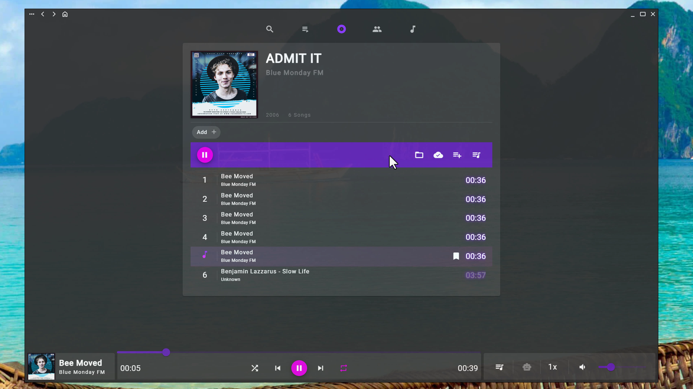
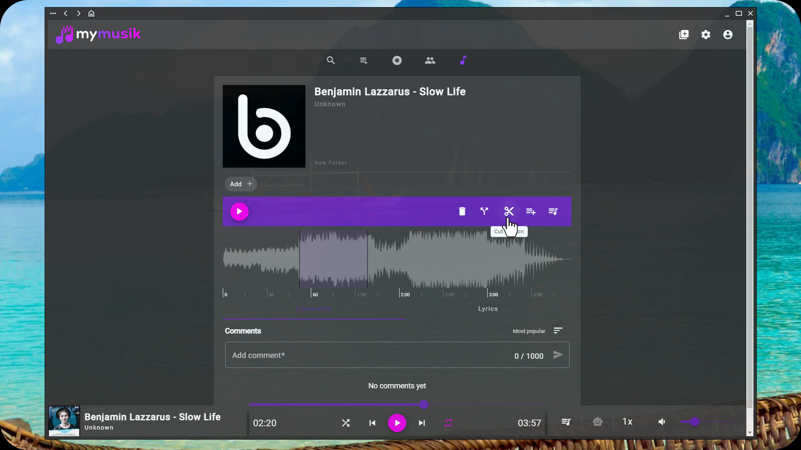
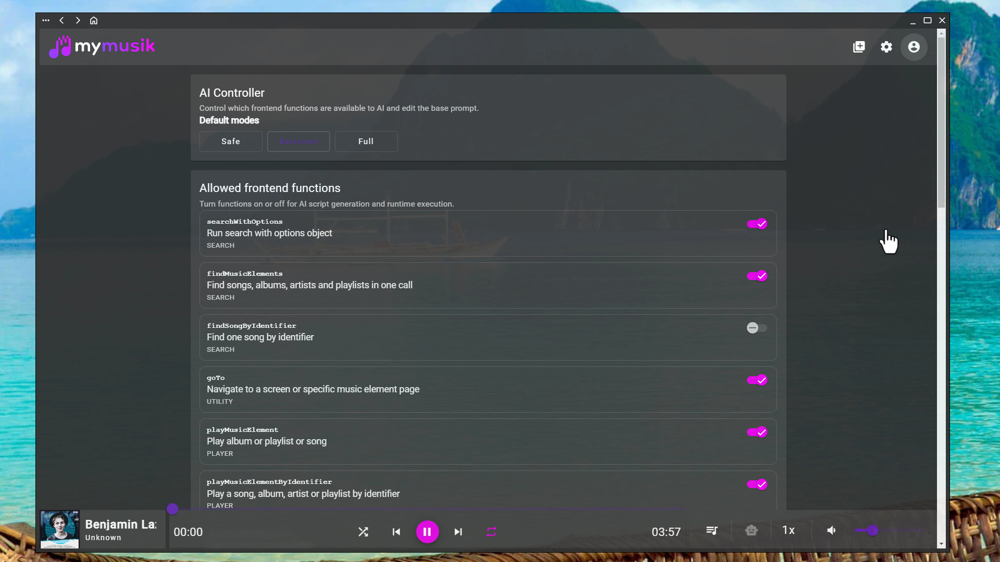
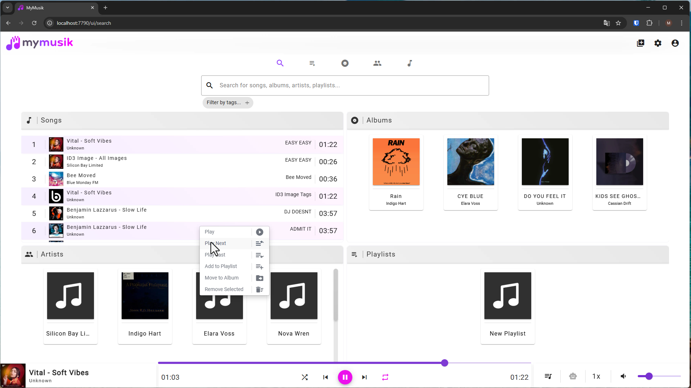
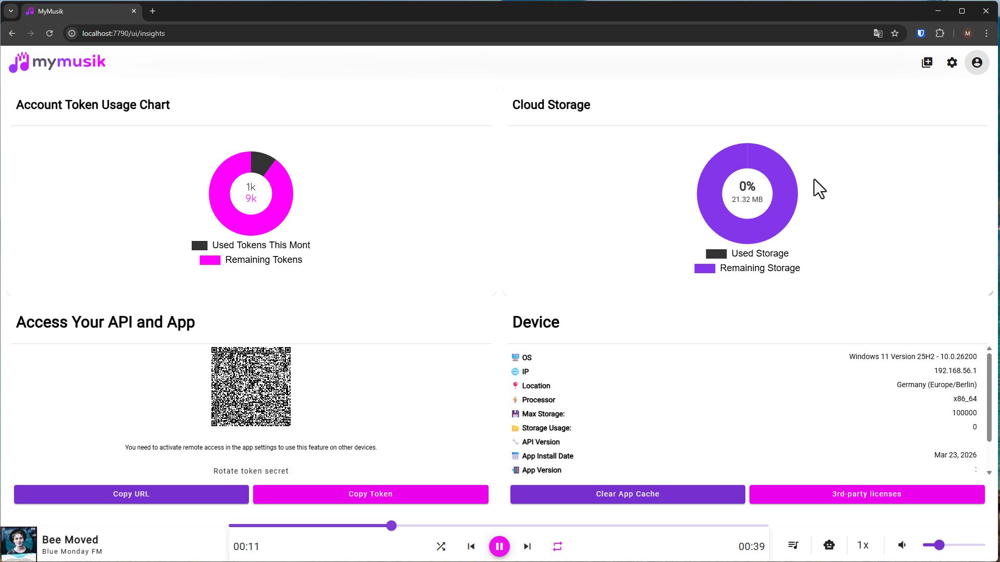
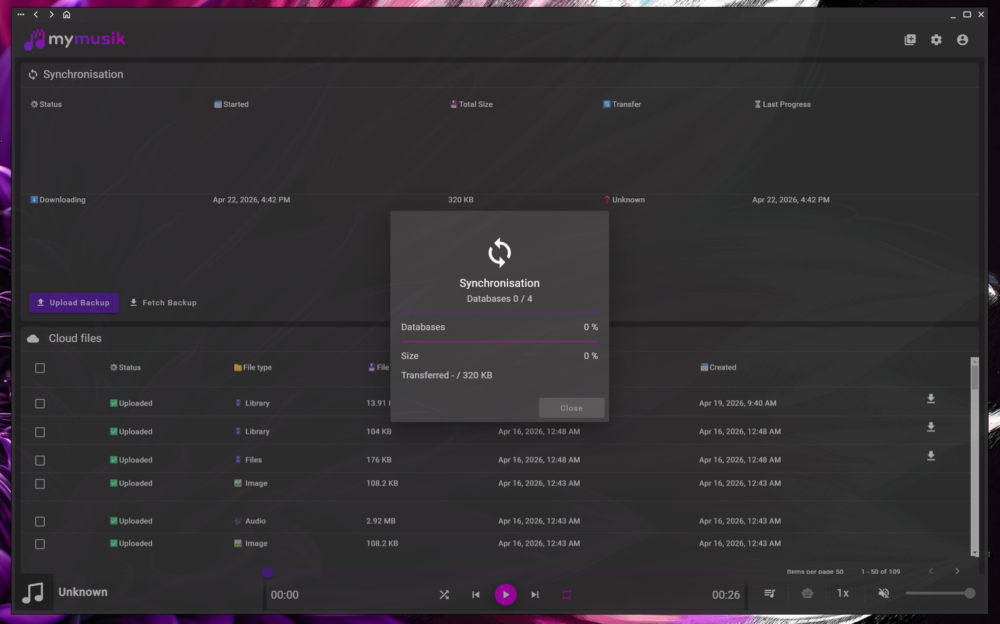

<p align="center">
  
</p>

# MyMusik API Showcase

**Your music. Your library. Everywhere.**

MyMusik is a modern music player for owned music libraries. It brings streaming-level convenience to personal MP3, WAV, FLAC, and local audio collections while keeping users in control of their files, metadata, tags, playlists, sync, backup, and privacy.

This repository is the public developer and marketing showcase for the MyMusik music-player API. It is not the full MyMusik app source code.

- Website: [mymusik.app](https://mymusik.app/)
- Hosted Swagger/API reference: [mymusik.app/swagger](https://mymusik.app/swagger/)
- Local Swagger after downloading and starting MyMusik: `http://localhost:7790/ui/swagger`
- Local API default: `http://localhost:7790/api`
- OpenAPI spec: [`openapi/doc.json`](openapi/doc.json)
- Hosted Angular client ZIP: [mymusik_angular_client.zip](https://shaggai.net/angular_client/client/mymusik_angular_client.zip)

## What You Can Build

MyMusik turns a device into local music infrastructure for playback, sync, and automation. The HTTP API can be used to:

- Control playback, queue state, playlists, albums, songs, ratings, tags, lyrics, and metadata.
- Trigger imports, cover art updates, selective sync, encrypted backup flows, and device jobs.
- Connect AI command flows to deterministic local music actions.
- Build dashboards, custom player UIs, network controllers, library tools, and automation scripts.

## Screenshots

| Album view | Song details | AI controls |
| --- | --- | --- |
|  |  |  |

| Search | Insights | Synchronization |
| --- | --- | --- |
|  |  |  |

## Quick Start

Open the hosted Swagger reference for the easiest API tour:

```text
https://mymusik.app/swagger/
```

After downloading and starting MyMusik, open the local in-app Swagger reference here:

```text
http://localhost:7790/ui/swagger
```

When MyMusik is running locally, the API server defaults to:

```text
http://localhost:7790/api
```

Example request with an access token:

```bash
curl -H "Authorization: Bearer $MYMUSIK_TOKEN" \
  http://localhost:7790/api/player
```

Start playback for selected songs. These shell examples use `jq` to turn the returned song array into the `SongList` body expected by the player endpoints.

```bash
export MYMUSIK_TOKEN="YOUR_ACCESS_TOKEN"
export MYMUSIK_API="http://localhost:7790/api"

curl -s -H "Authorization: Bearer $MYMUSIK_TOKEN" \
  "$MYMUSIK_API/song?sortBy=name&orderBy=ASC&pageIndex=0" \
  | jq '{ id: "", songs: .[0:3] }' \
  | curl -X POST "$MYMUSIK_API/player/playsongs" \
      -H "Authorization: Bearer $MYMUSIK_TOKEN" \
      -H "Content-Type: application/json" \
      --data-binary @-
```

Queue songs without interrupting the current track:

```bash
curl -s -H "Authorization: Bearer $MYMUSIK_TOKEN" \
  "$MYMUSIK_API/song?sortBy=created&orderBy=DESC&pageIndex=0" \
  | jq '{ id: "", songs: .[0:10] }' \
  | curl -X POST "$MYMUSIK_API/queueitem/addsongs" \
      -H "Authorization: Bearer $MYMUSIK_TOKEN" \
      -H "Content-Type: application/json" \
      --data-binary @-
```

Basic player controls:

```bash
curl -X POST -H "Authorization: Bearer $MYMUSIK_TOKEN" "$MYMUSIK_API/player/startstoptoggleplaying"
curl -X POST -H "Authorization: Bearer $MYMUSIK_TOKEN" "$MYMUSIK_API/player/nexttrack"
curl -X POST -H "Authorization: Bearer $MYMUSIK_TOKEN" "$MYMUSIK_API/queueitem/clear"
```

## Python Example

The OpenAPI spec can generate a Python client. If you use the hosted Python package ZIP, configure it for the local MyMusik API:

```python
import openapi_client

configuration = openapi_client.Configuration(
    host="http://localhost:7790/api",
    access_token="YOUR_ACCESS_TOKEN"
)

with openapi_client.ApiClient(configuration) as api_client:
    player_api = openapi_client.PlayerApi(api_client)
    players = player_api.service_player_get_page()
    print(players)
```

See [`clients/python`](clients/python) for the hosted package link and regeneration notes.

## Angular Client

The generated Angular API client from the MyMusik app is included under [`clients/angular`](clients/angular). It was generated by `ng-openapi-gen` and uses `http://localhost:7790/api` as its default root URL.

The website also links the hosted Angular client ZIP here:

```text
https://shaggai.net/angular_client/client/mymusik_angular_client.zip
```

Minimal Angular playback service:

```ts
import { Injectable } from '@angular/core';
import { switchMap } from 'rxjs';
import { PlayerService, QueueItemService, SongService } from './api/services';
import { SongList } from './api/models';

@Injectable({ providedIn: 'root' })
export class MyMusikPlayerExample {
  constructor(
    private readonly songs: SongService,
    private readonly player: PlayerService,
    private readonly queue: QueueItemService
  ) {}

  playFirstThreeSongs() {
    return this.songs.getPage({ sortBy: 'name', orderBy: 'ASC', pageIndex: 0 }).pipe(
      switchMap((songs) => {
        const body: SongList = { id: '', songs: songs.slice(0, 3) };
        return this.player.playSongs({ body });
      })
    );
  }

  addNewestSongsToQueue() {
    return this.songs.getPage({ sortBy: 'created', orderBy: 'DESC', pageIndex: 0 }).pipe(
      switchMap((songs) => {
        const body: SongList = { id: '', songs: songs.slice(0, 10) };
        return this.queue.addSongs({ body });
      })
    );
  }

  nextTrack() {
    return this.player.nextTrack();
  }

  togglePlayback() {
    return this.player.startStopTogglePlaying();
  }
}
```

See [`clients/angular`](clients/angular) for setup and auth interceptor examples.

## API Shape

The MyMusik API is object based. Most resources follow the same pattern:

- `GET /resource` returns a page of resources.
- `GET /resource/{id}` returns one resource.
- `POST /resource` inserts a resource.
- `PUT /resource/{id}` updates a resource.
- `DELETE /resource/{id}` deletes a resource.

Additional action endpoints exist for music-player workflows, for example playback control, queue edits, album cloud status, audio import, music search, and sync.

## Security Note

The API is protected with bearer access tokens. Remote access is disabled by default and should only be enabled deliberately. Keep tokens, `.env` files, installer credentials, and private deployment configuration out of this public repository.

## Repository Contents

```text
openapi/doc.json          OpenAPI 3.0.2 spec for the MyMusik music-player API
clients/angular/          Generated Angular/TypeScript API client
clients/python/           Hosted Python client link and generation notes
docs/                     Short integration docs
assets/logo_black.svg     MyMusik logo used by this README
assets/screenshots/       Public marketing screenshots
```

## License

The public API showcase files in this repository are released under the BSD 3-Clause License. See [`LICENSE`](LICENSE).
